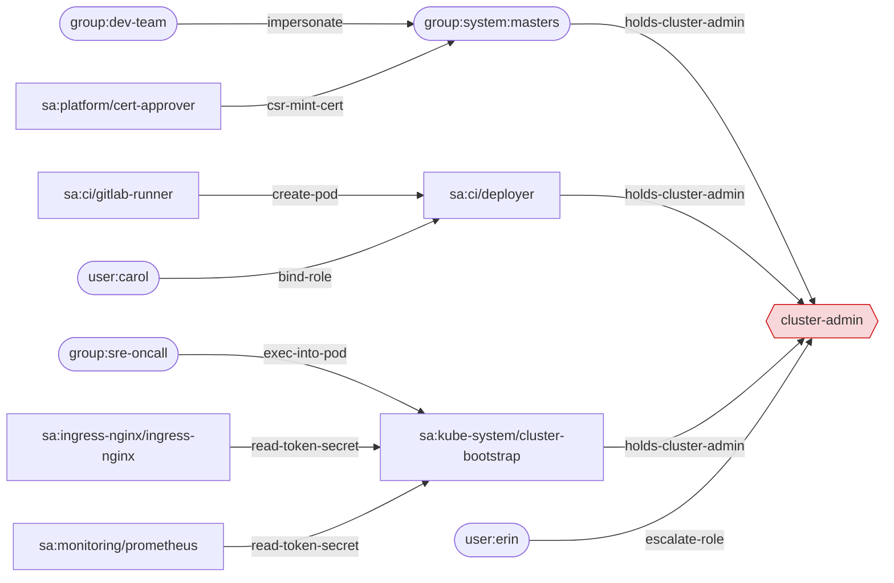

# rbacscope

[](https://github.com/Opsbreak/rbacscope/actions/workflows/ci.yml)

**Kubernetes RBAC effective-permissions and privilege-escalation analyzer.**

rbacscope reads an offline export of your cluster's RBAC objects and workloads
and answers the questions that matter during a security review:

- **Who can do X?** `rbacscope who-can create pods/exec -n kube-system`
- **What can this identity do?** `rbacscope can sa:ci/gitlab-runner`
- **What is risky?** `rbacscope audit` - 17 rules with severities, SARIF output
  for code scanning, and a `--fail-on` gate for CI.
- **How does a low-privilege identity become cluster-admin?**
  `rbacscope paths` - a privilege-escalation graph with shortest attack paths,
  each hop explained and backed by the binding that enables it.

It is a single static Go binary with one dependency (`gopkg.in/yaml.v3`). It
never talks to a cluster and never reads Secret data.

## Why

RBAC sprawls. A production cluster easily has thousands of bindings across
hundreds of namespaces, created by Helm charts, operators, CI pipelines and
humans. Reading them one at a time does not reveal risk, because the dangerous
permissions are usually *indirect*:

- **Pod creation is privilege inheritance.** Anyone who can create a pod (or a
  Deployment, Job, CronJob...) in a namespace can run it as *any* service
  account in that namespace and read its token. A CI runner that "only creates
  build pods" in a namespace that also holds a cluster-admin deploy account is
  a cluster-admin.
- **Aggregation hides rules.** `admin`, `edit` and `view` (and many operator
  roles) are assembled from other ClusterRoles by label selectors. What a role
  grants is not what its manifest says.
- **Delegation verbs escalate.** `bind`, `escalate`, `impersonate`,
  `serviceaccounts/token`, CSR approval and `nodes/proxy` each turn a narrow
  permission into someone else's identity.
- **Scope is subtle.** A RoleBinding to a ClusterRole only grants inside the
  binding's namespace and never grants cluster-scoped resources; a service
  account subject without a namespace silently defaults to the binding's.

rbacscope models these semantics faithfully and chains them into concrete
paths.

## Install

```sh
go install github.com/Opsbreak/rbacscope/cmd/rbacscope@latest
```

or build from a checkout:

```sh
go build -o rbacscope ./cmd/rbacscope
```

## Export your cluster

rbacscope works on plain manifests. Export with an account that can read RBAC
objects cluster-wide:

```sh
mkdir cluster-export

kubectl get clusterroles,clusterrolebindings,namespaces -o yaml > cluster-export/cluster.yaml

kubectl get roles,rolebindings,serviceaccounts,pods,deployments,statefulsets,daemonsets,replicasets,replicationcontrollers,jobs,cronjobs \
  --all-namespaces -o yaml > cluster-export/namespaced.yaml

# Service-account token Secrets: export metadata only. Strip data before it
# ever touches disk (rbacscope never decodes it, but it should not be stored).
kubectl get secrets --all-namespaces --field-selector type=kubernetes.io/service-account-token -o json \
  | jq '{apiVersion: "v1", kind: "List", items: [.items[] | {apiVersion, kind, type, metadata: {name: .metadata.name, namespace: .metadata.namespace, annotations: {"kubernetes.io/service-account.name": .metadata.annotations["kubernetes.io/service-account.name"]}}}]}' \
  > cluster-export/sa-token-secrets.json
```

Multi-document YAML, `kind: List` (as produced by `kubectl get -o yaml`),
typed lists (`RoleBindingList`, ...) and JSON are all accepted. Directories
are walked recursively (`.yaml`, `.yml`, `.json`; hidden directories are
skipped). Objects of other kinds are ignored. Treat the export as sensitive:
it maps your cluster's attack surface.

## Quickstart

The repository ships a realistic, deliberately misconfigured cluster in
[`testdata/cluster/`](testdata/cluster): built-in roles (with aggregated
`admin`/`edit`/`view`), an ingress controller, a CI runner, a monitoring
stack, a developer group with impersonation, delegated RBAC administration,
certificate and webhook automation, a dangling binding, and some well-scoped
subjects that must *not* be flagged.

All output below is real output of `rbacscope` on that fixture.

<!-- BEGIN GENERATED -->
### Find escalation paths

Every non-system subject that can reach cluster-admin, with the shortest path and the binding behind each hop:

```console
$ rbacscope paths -f testdata/cluster
Escalation graph: 33 nodes, 171 edges. Target: cluster-admin

sa:ci/deployer -> cluster-admin  (1 hop)
  1. sa:ci/deployer =[holds-cluster-admin]=> cluster-admin
     how: holds verbs=* apiGroups=* resources=* cluster-wide
     via: ClusterRoleBinding/ci-deployer-cluster-admin -> ClusterRole/cluster-admin

user:erin -> cluster-admin  (1 hop)
  1. user:erin =[escalate-role]=> cluster-admin
     how: add */*/* to ClusterRole role-curator, which is bound to it by ClusterRoleBinding/erin-role-curator
     via: ClusterRoleBinding/erin-role-curator -> ClusterRole/role-curator

group:dev-team -> cluster-admin  (2 hops)
  1. group:dev-team =[impersonate]=> group:system:masters
     how: impersonate group system:masters (Impersonate-User + Impersonate-Group headers)
     via: ClusterRoleBinding/dev-team-rbac-tester -> ClusterRole/rbac-tester
  2. group:system:masters =[holds-cluster-admin]=> cluster-admin
     how: member of system:masters (bypasses RBAC)

group:sre-oncall -> cluster-admin  (2 hops)
  1. group:sre-oncall =[exec-into-pod]=> sa:kube-system/cluster-bootstrap
     how: exec into Pod/kube-system/bootstrap-agent-0 (runs as cluster-bootstrap, token automounted) and read /var/run/secrets/kubernetes.io/serviceaccount/token
     via: RoleBinding/kube-system/sre-debug-exec -> Role/kube-system/debug-exec
  2. sa:kube-system/cluster-bootstrap =[holds-cluster-admin]=> cluster-admin
     how: holds verbs=* apiGroups=* resources=* cluster-wide
     via: ClusterRoleBinding/cluster-bootstrap-admin -> ClusterRole/cluster-admin

sa:ci/gitlab-runner -> cluster-admin  (2 hops)
  1. sa:ci/gitlab-runner =[create-pod]=> sa:ci/deployer
     how: create a pod in namespace ci with serviceAccountName: deployer
     via: RoleBinding/ci/gitlab-runner -> Role/ci/gitlab-runner
  2. sa:ci/deployer =[holds-cluster-admin]=> cluster-admin
     how: holds verbs=* apiGroups=* resources=* cluster-wide
     via: ClusterRoleBinding/ci-deployer-cluster-admin -> ClusterRole/cluster-admin

sa:ingress-nginx/ingress-nginx -> cluster-admin  (2 hops)
  1. sa:ingress-nginx/ingress-nginx =[read-token-secret]=> sa:kube-system/cluster-bootstrap
     how: read Secret kube-system/cluster-bootstrap-token-7xk2p (type service-account-token) holding a token for cluster-bootstrap
     via: ClusterRoleBinding/ingress-nginx -> ClusterRole/ingress-nginx
  2. sa:kube-system/cluster-bootstrap =[holds-cluster-admin]=> cluster-admin
     how: holds verbs=* apiGroups=* resources=* cluster-wide
     via: ClusterRoleBinding/cluster-bootstrap-admin -> ClusterRole/cluster-admin

sa:monitoring/prometheus -> cluster-admin  (2 hops)
  1. sa:monitoring/prometheus =[read-token-secret]=> sa:kube-system/cluster-bootstrap
     how: read Secret kube-system/cluster-bootstrap-token-7xk2p (type service-account-token) holding a token for cluster-bootstrap
     via: ClusterRoleBinding/prometheus -> ClusterRole/prometheus
  2. sa:kube-system/cluster-bootstrap =[holds-cluster-admin]=> cluster-admin
     how: holds verbs=* apiGroups=* resources=* cluster-wide
     via: ClusterRoleBinding/cluster-bootstrap-admin -> ClusterRole/cluster-admin

sa:platform/cert-approver -> cluster-admin  (2 hops)
  1. sa:platform/cert-approver =[csr-mint-cert]=> group:system:masters
     how: create a CSR for O=system:masters with signerName kubernetes.io/kube-apiserver-client and approve it
     via: ClusterRoleBinding/cert-approver -> ClusterRole/csr-automation
  2. group:system:masters =[holds-cluster-admin]=> cluster-admin
     how: member of system:masters (bypasses RBAC)

user:carol -> cluster-admin  (2 hops)
  1. user:carol =[bind-role]=> sa:ci/deployer
     how: create a ClusterRoleBinding of ClusterRole edit (which can create pods) to itself, then create a pod as deployer
     via: ClusterRoleBinding/carol-rbac-manager -> ClusterRole/rbac-manager
  2. sa:ci/deployer =[holds-cluster-admin]=> cluster-admin
     how: holds verbs=* apiGroups=* resources=* cluster-wide
     via: ClusterRoleBinding/ci-deployer-cluster-admin -> ClusterRole/cluster-admin

9 subject(s) can reach cluster-admin.
```

The same graph as Mermaid (`-o mermaid`, renders on GitHub; dashed edges are approximate). `-o dot` emits Graphviz:



Users' group memberships come from your identity provider, so pass them explicitly:

```console
$ rbacscope paths --from dana --group dev-team -f testdata/cluster
Escalation graph: 34 nodes, 208 edges. Target: cluster-admin

user:dana -> cluster-admin  (2 hops)
  1. user:dana =[impersonate]=> group:system:masters
     how: impersonate group system:masters (Impersonate-User + Impersonate-Group headers)
     via: ClusterRoleBinding/dev-team-rbac-tester -> ClusterRole/rbac-tester
  2. group:system:masters =[holds-cluster-admin]=> cluster-admin
     how: member of system:masters (bypasses RBAC)

1 subject(s) can reach cluster-admin.
```

### Audit

```console
$ rbacscope audit -f testdata/cluster --min-severity high
[CRITICAL] RS001 cluster-admin-equivalent  testdata/cluster/20-kube-system.yaml:19
    ClusterRoleBinding/cluster-bootstrap-admin grants sa:kube-system/cluster-bootstrap full wildcard access (verbs=* apiGroups=* resources=*) cluster-wide via ClusterRole/cluster-admin
[CRITICAL] RS001 cluster-admin-equivalent  testdata/cluster/40-ci.yaml:47
    ClusterRoleBinding/ci-deployer-cluster-admin grants sa:ci/deployer full wildcard access (verbs=* apiGroups=* resources=*) cluster-wide via ClusterRole/cluster-admin
[CRITICAL] RS003 rbac-escalate-bind  testdata/cluster/80-platform.yaml:38
    user:erin can escalate clusterroles cluster-wide via ClusterRole/role-curator
[CRITICAL] RS004 impersonation  testdata/cluster/60-dev.yaml:13
    group:dev-team can impersonate users, groups cluster-wide via ClusterRole/rbac-tester
[CRITICAL] RS005 workload-creation  testdata/cluster/40-ci.yaml:33
    sa:ci/gitlab-runner can create pods in namespace ci via Role/ci/gitlab-runner; the namespace contains cluster-admin-equivalent service account(s) sa:ci/deployer
[CRITICAL] RS007 nodes-proxy  testdata/cluster/50-monitoring.yaml:39
    sa:monitoring/prometheus can get nodes/proxy cluster-wide via ClusterRole/prometheus
[CRITICAL] RS008 secrets-read  testdata/cluster/30-ingress-nginx.yaml:42
    sa:ingress-nginx/ingress-nginx can list/watch secrets cluster-wide via ClusterRole/ingress-nginx
[CRITICAL] RS008 secrets-read  testdata/cluster/50-monitoring.yaml:39
    sa:monitoring/prometheus can get/list/watch secrets cluster-wide via ClusterRole/prometheus
[CRITICAL] RS010 csr-approve  testdata/cluster/80-platform.yaml:73
    sa:platform/cert-approver can create certificatesigningrequests and update certificatesigningrequests/approval cluster-wide via ClusterRole/csr-automation; also holds approve on the kube-apiserver-client signer, so it can mint client certificates for any identity including system:masters
[CRITICAL] RS011 admission-webhook-write  testdata/cluster/80-platform.yaml:101
    sa:platform/webhook-manager can create/update/patch mutatingwebhookconfigurations cluster-wide via ClusterRole/webhook-manager
[CRITICAL] RS013 broad-group-binding  testdata/cluster/90-legacy.json:39
    ClusterRoleBinding/anonymous-status grants ClusterRole/public-status to unauthenticated (anonymous) requests cluster-wide
[HIGH] RS003 rbac-escalate-bind  testdata/cluster/80-platform.yaml:16
    user:carol can bind clusterroles cluster-wide via ClusterRole/rbac-manager (limited to resourceNames [view, edit])
[HIGH] RS004 impersonation  testdata/cluster/60-dev.yaml:40
    user:alice can impersonate serviceaccounts in namespace dev via ClusterRole/edit (rule aggregated from ClusterRole/system:aggregate-to-edit)
[HIGH] RS004 impersonation  testdata/cluster/60-dev.yaml:54
    sa:dev/default can impersonate serviceaccounts in namespace dev via ClusterRole/edit (rule aggregated from ClusterRole/system:aggregate-to-edit)
[HIGH] RS005 workload-creation  testdata/cluster/60-dev.yaml:40
    user:alice can create pods, create/update/patch deployments, statefulsets, daemonsets, replicasets, jobs, cronjobs, replicationcontrollers in namespace dev via ClusterRole/edit (rule aggregated from ClusterRole/system:aggregate-to-edit); reachable service accounts: default
[HIGH] RS005 workload-creation  testdata/cluster/60-dev.yaml:54
    sa:dev/default can create pods, create/update/patch deployments, statefulsets, daemonsets, replicasets, jobs, cronjobs, replicationcontrollers in namespace dev via ClusterRole/edit (rule aggregated from ClusterRole/system:aggregate-to-edit); reachable service accounts: default
[HIGH] RS006 pod-exec-attach  testdata/cluster/20-kube-system.yaml:60
    group:sre-oncall can create pods/exec in namespace kube-system via Role/kube-system/debug-exec
[HIGH] RS006 pod-exec-attach  testdata/cluster/40-ci.yaml:33
    sa:ci/gitlab-runner can create pods/exec, create pods/attach in namespace ci via Role/ci/gitlab-runner
[HIGH] RS006 pod-exec-attach  testdata/cluster/60-dev.yaml:40
    user:alice can create/get pods/exec, create/get pods/attach in namespace dev via ClusterRole/edit (rule aggregated from ClusterRole/system:aggregate-to-edit)
[HIGH] RS006 pod-exec-attach  testdata/cluster/60-dev.yaml:54
    sa:dev/default can create/get pods/exec, create/get pods/attach in namespace dev via ClusterRole/edit (rule aggregated from ClusterRole/system:aggregate-to-edit)
[HIGH] RS008 secrets-read  testdata/cluster/30-ingress-nginx.yaml:72
    sa:ingress-nginx/ingress-nginx can get secrets in namespace ingress-nginx via Role/ingress-nginx/ingress-nginx
[HIGH] RS008 secrets-read  testdata/cluster/40-ci.yaml:33
    sa:ci/gitlab-runner can get/list/watch secrets in namespace ci via Role/ci/gitlab-runner
[HIGH] RS008 secrets-read  testdata/cluster/60-dev.yaml:40
    user:alice can get/list/watch secrets in namespace dev via ClusterRole/edit (rule aggregated from ClusterRole/system:aggregate-to-edit)
[HIGH] RS008 secrets-read  testdata/cluster/60-dev.yaml:54
    sa:dev/default can get/list/watch secrets in namespace dev via ClusterRole/edit (rule aggregated from ClusterRole/system:aggregate-to-edit)
[HIGH] RS009 serviceaccount-token-create  testdata/cluster/60-dev.yaml:40
    user:alice can create serviceaccounts/token in namespace dev via ClusterRole/edit (rule aggregated from ClusterRole/system:aggregate-to-edit)
[HIGH] RS009 serviceaccount-token-create  testdata/cluster/60-dev.yaml:54
    sa:dev/default can create serviceaccounts/token in namespace dev via ClusterRole/edit (rule aggregated from ClusterRole/system:aggregate-to-edit)
[HIGH] RS011 admission-webhook-write  testdata/cluster/80-platform.yaml:101
    sa:platform/webhook-manager can create/update/patch validatingwebhookconfigurations cluster-wide via ClusterRole/webhook-manager
[HIGH] RS012 persistentvolume-create  testdata/cluster/80-platform.yaml:132
    sa:platform/storage-provisioner can create persistentvolumes cluster-wide via ClusterRole/pv-provisioner; a hostPath PersistentVolume exposes node filesystems
[HIGH] RS013 broad-group-binding  testdata/cluster/90-legacy.json:77
    ClusterRoleBinding/all-users-configmaps grants ClusterRole/configmap-reader to every authenticated identity, including every service account cluster-wide
[HIGH] RS017 pod-runs-as-admin-sa  testdata/cluster/20-kube-system.yaml:32
    Pod/kube-system/bootstrap-agent-0 runs as sa:kube-system/cluster-bootstrap, which is cluster-admin-equivalent, with its token automounted. The pod is also privileged or mounts hostPath volumes.
[HIGH] RS017 pod-runs-as-admin-sa  testdata/cluster/40-ci.yaml:75
    CronJob/ci/nightly-deploy runs as sa:ci/deployer, which is cluster-admin-equivalent, with its token automounted.

31 findings: 11 critical, 20 high, 0 medium, 0 low, 0 info
```

Use `--fail-on` as a CI gate (exit code 3):

```console
$ rbacscope audit -f testdata/cluster --fail-on critical > /dev/null; echo $?
3
```

SARIF 2.1.0 for GitHub code scanning (`-o sarif`); first result, verbatim:

```json
{
  "ruleId": "RS001",
  "ruleIndex": 0,
  "level": "error",
  "message": {
    "text": "ClusterRoleBinding/cluster-bootstrap-admin grants sa:kube-system/cluster-bootstrap full wildcard access (verbs=* apiGroups=* resources=*) cluster-wide via ClusterRole/cluster-admin"
  },
  "locations": [
    {
      "physicalLocation": {
        "artifactLocation": {
          "uri": "testdata/cluster/20-kube-system.yaml"
        },
        "region": {
          "startLine": 19
        }
      }
    }
  ],
  "relatedLocations": [
    {
      "id": 1,
      "physicalLocation": {
        "artifactLocation": {
          "uri": "testdata/cluster/10-builtin-rbac.yaml"
        },
        "region": {
          "startLine": 4
        }
      },
      "message": {
        "text": "role ClusterRole/cluster-admin"
      }
    }
  ],
  "partialFingerprints": {
    "rbacscope/v1": "60b7b512eb740cbb"
  },
  "properties": {
    "security-severity": "9.5",
    "severity": "critical",
    "subjects": [
      "sa:kube-system/cluster-bootstrap"
    ]
  }
}
```

### Who can...?

```console
$ rbacscope who-can list secrets -f testdata/cluster
Who can list secrets (any namespace):

SUBJECT                           SCOPE         BINDING                                       ROLE                       NOTES
user:alice                        ns/dev        RoleBinding/dev/alice-edit                    ClusterRole/edit           rule from ClusterRole/system:aggregate-to-edit
group:system:masters              cluster-wide  ClusterRoleBinding/cluster-admin              ClusterRole/cluster-admin
sa:ci/deployer                    cluster-wide  ClusterRoleBinding/ci-deployer-cluster-admin  ClusterRole/cluster-admin
sa:ci/gitlab-runner               ns/ci         RoleBinding/ci/gitlab-runner                  Role/ci/gitlab-runner
sa:dev/default                    ns/dev        RoleBinding/dev/default-sa-edit               ClusterRole/edit           rule from ClusterRole/system:aggregate-to-edit
sa:ingress-nginx/ingress-nginx    cluster-wide  ClusterRoleBinding/ingress-nginx              ClusterRole/ingress-nginx
sa:kube-system/cluster-bootstrap  cluster-wide  ClusterRoleBinding/cluster-bootstrap-admin    ClusterRole/cluster-admin
sa:monitoring/prometheus          cluster-wide  ClusterRoleBinding/prometheus                 ClusterRole/prometheus

Members of system:masters are always allowed (the API server bypasses RBAC for them).
```

```console
$ rbacscope who-can create pods -n ci -f testdata/cluster
Who can create pods (namespace ci):

SUBJECT                           SCOPE         BINDING                                       ROLE                       NOTES
group:system:masters              cluster-wide  ClusterRoleBinding/cluster-admin              ClusterRole/cluster-admin
sa:ci/deployer                    cluster-wide  ClusterRoleBinding/ci-deployer-cluster-admin  ClusterRole/cluster-admin
sa:ci/gitlab-runner               ns/ci         RoleBinding/ci/gitlab-runner                  Role/ci/gitlab-runner
sa:kube-system/cluster-bootstrap  cluster-wide  ClusterRoleBinding/cluster-bootstrap-admin    ClusterRole/cluster-admin

Members of system:masters are always allowed (the API server bypasses RBAC for them).
```

### What can...?

```console
$ rbacscope can sa:monitoring/prometheus list secrets -f testdata/cluster
can sa:monitoring/prometheus list secrets (any namespace)? YES
  namespaces: *
  cluster-wide: ClusterRoleBinding/prometheus -> ClusterRole/prometheus
```

```console
$ rbacscope can bob get secrets -n payments --name payments-db -f testdata/cluster
can user:bob get secrets name=payments-db (namespace payments)? no
```

```console
$ rbacscope can sa:ci/gitlab-runner -f testdata/cluster
Subject:  sa:ci/gitlab-runner
Username: system:serviceaccount:ci:gitlab-runner
Groups:   system:serviceaccounts, system:serviceaccounts:ci, system:authenticated
Cluster-admin equivalent: no

SCOPE         VERBS                                      APIGROUPS             RESOURCES                                                                                       NAMES  GRANTED BY
cluster-wide  get,list,watch                             ""                    configmaps                                                                                      -      ClusterRoleBinding/all-users-configmaps -> ClusterRole/configmap-reader [as group:system:authenticated]
cluster-wide  get                                        *                     */status                                                                                        -      ClusterRoleBinding/all-users-configmaps -> ClusterRole/configmap-reader [as group:system:authenticated]
cluster-wide  create                                     authorization.k8s.io  selfsubjectaccessreviews,selfsubjectrulesreviews                                                -      ClusterRoleBinding/system:basic-user -> ClusterRole/system:basic-user [as group:system:authenticated]
cluster-wide  get                                        -                     urls: /api,/api/*,/apis,/apis/*,/healthz,/livez,/openapi,/openapi/*,/readyz,/version,/version/  -      ClusterRoleBinding/system:discovery -> ClusterRole/system:discovery [as group:system:authenticated]
cluster-wide  get                                        -                     urls: /healthz,/livez,/readyz,/version,/version/                                                -      ClusterRoleBinding/system:public-info-viewer -> ClusterRole/system:public-info-viewer [as group:system:authenticated]
ns/ci         get,list,watch,create,patch,update,delete  ""                    pods,secrets,configmaps                                                                         -      RoleBinding/ci/gitlab-runner -> Role/ci/gitlab-runner
ns/ci         create,patch,delete                        ""                    pods/exec,pods/attach                                                                           -      RoleBinding/ci/gitlab-runner -> Role/ci/gitlab-runner
ns/ci         get                                        ""                    pods/log                                                                                        -      RoleBinding/ci/gitlab-runner -> Role/ci/gitlab-runner
```
<!-- END GENERATED -->

## Query reference

Common flags: `-f PATH` (repeatable, files or directories, `-` for stdin),
`-o FORMAT`, `-q` (suppress loader warnings). Flags may appear before or after
positional arguments.

### Subjects

| Syntax | Meaning |
| --- | --- |
| `alice`, `user:alice` | User `alice` (assumed authenticated: member of `system:authenticated`) |
| `group:dev` | An arbitrary member of group `dev` (plus `system:authenticated`) |
| `sa:ci/runner`, `system:serviceaccount:ci:runner` | ServiceAccount `runner` in `ci` (plus `system:serviceaccounts`, `system:serviceaccounts:ci`, `system:authenticated`) |

Group membership of users is not stored in RBAC objects. Use `--group G`
(repeatable) on `can` and `paths` to evaluate a user as a member of groups.

### `who-can VERB RESOURCE[/SUBRESOURCE]`

| Flag | Meaning |
| --- | --- |
| `-n NS` | Evaluate in one namespace (ClusterRoleBindings + RoleBindings in `NS`). Default: every namespace, with a SCOPE column. |
| `--name NAME` | Object name; rules restricted by `resourceNames` must include it. Without `--name`, name-restricted rules are listed with their names. |
| `--api-group G` | API group (`core` for the core group). Also accepted: `deployments.apps`, `widgets.example.com/status`. Well-known resources are resolved automatically. |
| `-o text\|json` | Output format. |

`RESOURCE` starting with `/` is a non-resource URL (`who-can get /metrics`).
Cluster-scoped resources (nodes, persistentvolumes, clusterroles, CSRs,
webhook configurations, impersonation of users/groups, ...) are evaluated
against ClusterRoleBindings only, exactly like the API server. The one
exception is `bind` on `clusterroles`, which the API server checks in the
namespace of the RoleBinding being created.

### `can SUBJECT [VERB RESOURCE]`

Without `VERB RESOURCE`: the effective permission table (every rule, its scope,
the binding and role that grant it, and the aggregated source role).
With `VERB RESOURCE`: a yes/no answer with evidence, for one namespace (`-n`)
or across all namespaces.

### `audit`

| Flag | Meaning |
| --- | --- |
| `-o text\|json\|sarif` | SARIF 2.1.0 results carry the manifest file and line of the binding (or pod), the role as a related location, rule metadata with `security-severity`, and stable fingerprints. |
| `--min-severity SEV` | Hide findings below `SEV`. |
| `--fail-on SEV` | Exit with code 3 if any reported finding is at or above `SEV`. |
| `--include-system` | Also audit bootstrap bindings (`system:*`, `kubeadm:*`, label `kubernetes.io/bootstrapping=rbac-defaults`). RS015 always includes them. |

### `paths`

| Flag | Meaning |
| --- | --- |
| `--from SUBJECT` | Source(s), repeatable. Default: every subject except `system:*` principals and kube-system service accounts. |
| `--group G` | Treat `--from` subjects as members of `G`. |
| `--to cluster-admin\|SUBJECT` | Target. `cluster-admin` (default) means holding `verbs=* apiGroups=* resources=*` through a ClusterRoleBinding, or membership of `system:masters`. |
| `--include-system` | Include system principals as sources. |
| `-o text\|json\|dot\|mermaid` | DOT and Mermaid render the union of all shortest paths; approximate edges are dashed. |

### Exit codes

| Code | Meaning |
| --- | --- |
| 0 | Success |
| 1 | Runtime error (unreadable or invalid input) |
| 2 | Usage error |
| 3 | `audit --fail-on` threshold reached |

### CI usage

```yaml
# job needs: permissions: { contents: read, security-events: write }
- run: rbacscope audit -f cluster-export -o sarif > rbacscope.sarif
- uses: github/codeql-action/upload-sarif@9f759ee644a3e7c15c1390abf49868036c00067b # v3.38.3
  with:
    sarif_file: rbacscope.sarif
- run: rbacscope audit -f cluster-export --fail-on critical
```

## Audit rules

Severity depends on scope: the same permission granted cluster-wide is rated
higher than inside one namespace, and rules restricted with `resourceNames`
are rated one level lower (except where the named object is itself the risk,
such as impersonating `system:masters`). Built-in bootstrap bindings are
skipped unless `--include-system` is given. A binding granting `*/*/*` reports
RS001 only; the narrower rules are implied.

<!-- BEGIN RULES -->
| ID | Name | Default severity | What it detects | Remediation |
| --- | --- | --- | --- | --- |
| RS001 | `cluster-admin-equivalent` | critical | The bound role allows every verb on every resource in every API group. Through a ClusterRoleBinding this is cluster-admin; through a RoleBinding it is full control of the namespace, including its secrets and service accounts. | Replace the wildcard rule with the specific verbs/resources required. Reserve cluster-admin for break-glass identities and bind it through short-lived, audited access. |
| RS002 | `wildcard-rule` | medium | Wildcards automatically extend to subresources, new verbs and resources added by CRDs or future Kubernetes versions, so the effective permission silently grows over time. | Enumerate the verbs, apiGroups and resources explicitly. |
| RS003 | `rbac-escalate-bind` | critical | The escalate verb lets a subject create or update roles containing permissions it does not hold; bind lets it create bindings to roles it does not hold. Either bypasses RBAC privilege-escalation prevention (e.g. binding itself to cluster-admin). | Remove escalate/bind. If delegation is required, restrict bind with resourceNames to the specific low-privilege roles that may be delegated. |
| RS004 | `impersonation` | critical | impersonate on users, groups, uids or serviceaccounts lets the subject act as any of those identities, e.g. as a member of system:masters. | Remove impersonate or restrict it with resourceNames to specific, low-privilege identities. |
| RS005 | `workload-creation` | high | Anyone who can create pods (directly or through Deployments, DaemonSets, Jobs, ...) in a namespace can run a pod as ANY service account in that namespace and read its token, inheriting all of that service account's permissions. They can also mount secrets and configmaps of the namespace. | Grant workload creation only in namespaces whose service accounts are no more privileged than the subject. Keep privileged service accounts in dedicated namespaces; enforce Pod Security Admission and an admission policy restricting serviceAccountName. |
| RS006 | `pod-exec-attach` | high | pods/exec and pods/attach give a shell in running containers and therefore access to their mounted service account tokens, secrets and network position. (On clusters before 1.31, get on pods/exec also permits exec over WebSocket.) | Remove pods/exec and pods/attach from routine roles; use just-in-time access for debugging. |
| RS007 | `nodes-proxy` | critical | nodes/proxy reaches the kubelet API, which allows running commands in any pod on the node and bypasses API server audit logging and admission. | Remove nodes/proxy. Monitoring agents should use the /metrics endpoints via nodes/metrics or the metrics API instead. |
| RS008 | `secrets-read` | high | get/list/watch on secrets exposes credentials, including legacy service account tokens. Note that list and watch return full secret contents. Cluster-wide read is equivalent to obtaining every credential stored in the cluster. | Restrict secret access to specific namespaces and, where possible, specific resourceNames with get only. |
| RS009 | `serviceaccount-token-create` | high | create on serviceaccounts/token issues a bound token for a service account, granting all of its permissions. | Remove serviceaccounts/token create or restrict it with resourceNames. |
| RS010 | `csr-approve` | critical | create on certificatesigningrequests plus update on certificatesigningrequests/approval (and approve on the kube-apiserver-client signer) lets the subject mint client certificates for any user or group, including system:masters. | Separate CSR creation and approval duties; restrict approve on signers to specific signerNames via resourceNames. |
| RS011 | `admission-webhook-write` | high | Mutating webhooks can inject containers, service accounts or privileged settings into every pod created in the cluster; validating webhooks receive every admitted object, including secrets, and can deny traffic. | Limit webhook configuration writes to the deployment pipeline identity. |
| RS012 | `persistentvolume-create` | high | A PersistentVolume can point at a hostPath on a node; binding it to a claim gives pods access to the node filesystem regardless of Pod Security settings on hostPath volumes. | Use dynamic provisioning through StorageClasses and remove create on persistentvolumes. |
| RS013 | `broad-group-binding` | high | Subjects system:unauthenticated / system:anonymous apply to anyone who can reach the API server; system:authenticated applies to every identity including every service account in the cluster; system:serviceaccounts applies to every service account. | Bind to specific users, groups or service accounts. |
| RS014 | `default-sa-privileged` | medium | Pods that do not set serviceAccountName run as "default". When that service account has RBAC permissions and the token is automounted, every such pod receives them. | Create a dedicated service account per workload, remove bindings from "default", and set automountServiceAccountToken: false on the default service account. |
| RS015 | `cluster-admin-inventory` | info | Inventory of every binding to the cluster-admin ClusterRole (or an equivalent */*/* role), including built-in ones, for review. | Review periodically; every entry should be expected and owned. |
| RS016 | `dangling-binding` | low | The binding grants nothing today, but whoever later creates a role with that name silently grants it to the binding's subjects. | Delete the binding or create the intended role. |
| RS017 | `pod-runs-as-admin-sa` | high | The pod mounts a token for a service account that is cluster-admin-equivalent. Compromise of any container in the pod (RCE, SSRF to the token file, exec) is full cluster compromise. | Give the workload a least-privilege service account, or disable automountServiceAccountToken if it does not call the API. |
<!-- END RULES -->

## Escalation techniques

Each edge in the `paths` graph is one of these techniques. Every hop in the
output names the binding and role that make it possible.

| Technique | From permission | Gains | Notes |
| --- | --- | --- | --- |
| `create-pod` | `create pods` in ns | every SA in ns | The pod spec chooses `serviceAccountName` and can force `automountServiceAccountToken: true`, so SA-level automount settings do not protect against this. |
| `modify-workload` | `create` (or `update`/`patch` of an existing object) on deployments, daemonsets, statefulsets, replicasets, jobs, cronjobs, replicationcontrollers | every SA in ns | The controller creates the pod; the pod template's `serviceAccountName` can be changed. Name-restricted `patch` only counts if a workload with that name exists in the input. |
| `create-token` | `create serviceaccounts/token` | that SA | TokenRequest API. `resourceNames` restrictions are honoured. |
| `impersonate` | `impersonate users/groups/serviceaccounts` | the impersonated identity | Group impersonation requires user impersonation too. Impersonating any group includes `system:masters`. Impersonating usernames `system:serviceaccount:ns:name` reaches SAs. |
| `bind-role` | `create (cluster)rolebindings` + `bind` on a role | the role's permissions | Binding cluster-admin cluster-wide is a direct edge to the target. Binding a pod-creating role (e.g. `edit`) in a namespace leads to every SA of that namespace. |
| `escalate-role` | `escalate` + `update/patch` on a ClusterRole bound to oneself, or `escalate` + `create clusterroles` + `create clusterrolebindings` | cluster-admin | Namespaced variant: `escalate` + `create roles` + `create rolebindings`. |
| `read-token-secret` | `get` (named) or `list/watch` secrets in ns | the SA named in each `kubernetes.io/service-account-token` Secret | Requires token Secret metadata in the export. |
| `exec-into-pod` | `create pods/exec` or `pods/attach` | SA of each existing pod with an automounted token | Pods derived from workload templates are matched by namespace (their pod names are not known offline). |
| `kubelet-nodes-proxy` | `get`/`create nodes/proxy` | SA of pods on the reachable nodes | **Approximate** (flagged, dashed in graphs): pod-to-node placement is only known for exported Pods with `nodeName`. |
| `csr-mint-cert` | `create certificatesigningrequests` + `update .../approval` + `approve signers` (kube-apiserver-client) | `group:system:masters` | Mint and approve a client certificate with `O=system:masters`. |
| `holds-cluster-admin` | `*/*/*` via ClusterRoleBinding, or `system:masters` | target | Terminal edge. |

## Semantics coverage

Modelled after the upstream RBAC authorizer
(`pkg/apis/rbac/v1/evaluation_helpers.go`, `plugin/pkg/auth/authorizer/rbac`):

- Verbs, API groups and resources with `*` wildcards; subresources as
  `resource/sub`; `*/sub` matches that subresource of any resource; plain
  `pods` does **not** match `pods/exec`, and `pods/*` is **not** a wildcard.
- `resourceNames`: a restricted rule never authorizes requests without a name
  (top-level `create`, `deletecollection`, unfiltered `list`). Subresource
  creates such as `serviceaccounts/token` carry the parent's name.
- `nonResourceURLs` with exact match, `*`, and trailing-`*` prefix match; only
  effective through ClusterRoleBindings.
- RoleBinding to ClusterRole: scoped to the binding's namespace; never grants
  cluster-scoped resources or non-resource URLs.
- RoleBindings referencing a missing Role/ClusterRole, or a Role in another
  namespace, are dangling and grant nothing (reported as RS016).
- Subjects: User, Group and ServiceAccount; User subjects of the form
  `system:serviceaccount:ns:name` are service accounts; SA subjects without a
  namespace default to the RoleBinding's namespace (and never match in a
  ClusterRoleBinding, which is reported as a warning).
- Implicit groups: `system:authenticated`, `system:unauthenticated` (for
  `system:anonymous`), `system:serviceaccounts`,
  `system:serviceaccounts:<ns>`. Members of `system:masters` bypass RBAC.
- ClusterRole aggregation via `matchLabels` and `matchExpressions`
  (`In`, `NotIn`, `Exists`, `DoesNotExist`), resolved iteratively to a fixpoint
  (nested aggregation such as `admin` <- `edit` <- `view` and cycles are
  handled). Rules are attributed to the ClusterRole that defines them. The
  exported `rules` of an aggregated role are kept as well, so both a
  live-cluster export (rules already filled in) and hand-written manifests
  (rules empty) work.
- Automount: pod `automountServiceAccountToken` overrides the service
  account's, which defaults to true. Every namespace has an implicit `default`
  service account.

## Limitations

- **No admission modelling.** Pod Security Admission, ValidatingAdmissionPolicy,
  Gatekeeper/Kyverno, and webhooks can block some techniques (for example a
  policy pinning `serviceAccountName`). rbacscope reports what RBAC allows.
- **Other authorizers are not modelled** (Node authorizer, webhook
  authorizers, cloud IAM mappings such as EKS access entries or GKE IAM).
- **Group membership is external.** Users' groups come from the
  authenticator; supply them with `--group`.
- **Approximations are flagged.** `nodes/proxy` reachability depends on pod
  placement; workload template pods are matched by namespace rather than name
  for `exec`.
- **Not modelled as escalation edges:** mutating webhooks (reported by RS011),
  hostPath PersistentVolumes (RS012), `pods/ephemeralcontainers`, `nodes`
  status/label tampering, and CRD-specific operator privileges.
- Only the RBAC objects in the export are considered; anything not exported
  (or created later) is invisible.

## Benchmarks

<!-- BEGIN BENCH -->
Measured with `go test ./internal/synth -run '^$' -bench . -benchmem` (Go 1.27.0, Windows 11, Intel Core i7-14700) on a deterministic synthetic cluster from [`internal/synth`](internal/synth/synth.go):

```text
input: 1221223 bytes YAML, 56 ClusterRoles, 250 Roles, 200 ClusterRoleBindings, 5000 RoleBindings, 2000 ServiceAccounts, 1500 workloads, 250 namespaces
graph: 2786 nodes, 377266 edges, 631 sources with a path to cluster-admin
```

```text
goos: windows
goarch: amd64
cpu: Intel(R) Core(TM) i7-14700
BenchmarkLoadYAML-28           	      14	  84043807 ns/op	  14.53 MB/s	52134844 B/op	 1018719 allocs/op
BenchmarkNewEngine-28          	     445	   2297849 ns/op	 1898162 B/op	   21127 allocs/op
BenchmarkWhoCan-28             	     384	   3693567 ns/op	 2510227 B/op	   10560 allocs/op
BenchmarkAudit-28              	      16	  74311044 ns/op	11587946 B/op	  166787 allocs/op
BenchmarkPathsAllSources-28    	       3	 465636133 ns/op	586891024 B/op	 5296404 allocs/op
```

| Operation | Time per run |
| --- | --- |
| `BenchmarkLoadYAML` | 84.0 ms |
| `BenchmarkNewEngine` | 2.3 ms |
| `BenchmarkWhoCan` | 3.7 ms |
| `BenchmarkAudit` | 74.3 ms |
| `BenchmarkPathsAllSources` | 465.6 ms |

`BenchmarkPathsAllSources` builds the full escalation graph and computes shortest paths for every subject; `BenchmarkAudit` includes engine construction. Numbers will vary by machine.
<!-- END BENCH -->

## Development

See [CONTRIBUTING.md](CONTRIBUTING.md). Security reports: see
[SECURITY.md](SECURITY.md).

## License

MIT - Copyright (c) 2026 Opsbreak Inc. See [LICENSE](LICENSE).
